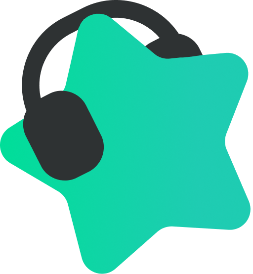

<a name="readme-top"></a>


[![Contributors][contributors-shield]][contributors-url]
[![Forks][forks-shield]][forks-url]
[![Stargazers][stars-shield]][stars-url]
[![Issues][issues-shield]][issues-url]

<br />
<div align="center">
  <a href="https://github.com/zennvote/zennbot-server-2">
    
  </a>

<h3 align="center">젠프로봇</h3>

  <p align="center">
    젠프로덕션의 챗봇 어플리케이션을 위한 API Server입니다.
    <br />
    <a href="https://github.com/zennvote/zennbot-server-2/issues">Report Bug</a>
    ·
    <a href="https://github.com/zennvote/zennbot-server-2/issues">Request Feature</a>
  </p>
</div>


## 프로젝트 소개

[![Zennbot Screen Shot][product-screenshot]](https://zennbot.net/)
젠프로덕션 음악방송에서 사용되는 챗봇 및 대시보드 어플리케이션입니다. 

구글 시트로 관리되던 사용자 포인트 정보를 이용하여 신청곡 신청 및 포인트 차감, 지급 등을 자동화합니다.


## 사용 기술

[![TypeScript][TypeScript]][TypeScript-url] [![NestJs][NestJs]][NestJs-url] [![Prisma][Prisma]][Prisma-url]

[![avajs][avajs]][avajs-url] [![Jest][Jest]][Jest-url]

[![PostgreSQL][PostgreSQL]][PostgreSQL-url] [![Google Sheets][Google Sheets]][Google Sheets-url]

[![GithubActions][GithubActions]][GithubActions-url]

[![Docker][Docker]][Docker-url]


## 프로젝트 구성
현재 기존 아키텍쳐와 신규 아키텍쳐가 동시에 존재합니다. 모든 레거시 아키텍쳐를 신규 아키텍쳐로 점진적 이관하려고 합니다.

### 신규 아키텍쳐
실행 흐름을 `domain` | `application` | `infrastructure` 의 세가지 레이어로 구분했습니다.
이 외에 본 프로젝트의 유즈케이스와는 크게 관련 없는 코드들은 `libs` 및 `utils`에서 관리합니다.

```
▼ domain
  ▼ songs
    - songs.entity.ts
      해당 도메인 모듈에 필요한 엔티티 정의를 담고 있습니다.
    - songs.service.ts
      해당 도메인 모듈의 도메인 서비스를 담고 있습니다.
    - songs.repository.ts
      해당 도메인 모듈의 영속화를 위한 레포지토리 인터페이스를 담고 있습니다.
    - songs.ava.ts
      해당 도메인 모듈에 대한 테스트 코드를 담고 있습니다.
  ▼ viewers
  ▼ ...
▼ application
  ▼ songs
    ▼ specs
      - request-song.ava.ts
        해당 어플리케이션의 각 유즈케이스에 대한 테스트 코드를 담고 있습니다.
    - songs.application.ts
      해당 어플리케이션의 유즈케이스를 담는 어플리케이션 서비스를 담고 있습니다.
  ▼ viewers
  ▼ ...
▼ infrastructure
  ▼ persistence
    ▼ songs
      - songs.repository.ts
        도메인 레이어에 정의된 레포지토리 인터페이스의 구현체를 담고 있습니다.
      - songs.mock.ts
        도메인 레이어의 레포지토리 인터페이스를 테스트를 위한 mock 데이터를 반환하도록 구현한 구현체를 담고 있습니다
    ▼ viewers
    ▼ ...
  ▼ presentation
    ▼ songs
      - 
    ▼ viewers
    ▼ ...
```


<!-- MARKDOWN LINKS & IMAGES -->
<!-- https://www.markdownguide.org/basic-syntax/#reference-style-links -->
[contributors-shield]: https://img.shields.io/github/contributors/zennvote/zennbot-server-2.svg?style=for-the-badge
[contributors-url]: https://github.com/zennvote/zennbot-server-2/graphs/contributors
[forks-shield]: https://img.shields.io/github/forks/zennvote/zennbot-server-2.svg?style=for-the-badge
[forks-url]: https://github.com/zennvote/zennbot-server-2/network/members
[stars-shield]: https://img.shields.io/github/stars/zennvote/zennbot-server-2.svg?style=for-the-badge
[stars-url]: https://github.com/zennvote/zennbot-server-2/stargazers
[issues-shield]: https://img.shields.io/github/issues/zennvote/zennbot-server-2.svg?style=for-the-badge
[issues-url]: https://github.com/zennvote/zennbot-server-2/issues

[product-screenshot]: images/screenshot-zennbot.png

[TypeScript]: https://img.shields.io/badge/TypeScript-3178C6?style=for-the-badge&logo=TypeScript&logoColor=white
[TypeScript-url]: https://nestjs.com/
[NestJs]: https://img.shields.io/badge/NestJs-000000?style=for-the-badge&logo=NestJS&logoColor=E0234E
[NestJs-url]: https://nestjs.com/
[Prisma]: https://img.shields.io/badge/Prisma-2D3748?style=for-the-badge&logo=Prisma&logoColor=white
[Prisma-url]: https://nestjs.com/
[PostgreSQL]: https://img.shields.io/badge/PostgreSQL-4169E1?style=for-the-badge&logo=PostgreSQL&logoColor=white
[PostgreSQL-url]: https://nestjs.com/
[Google Sheets]: https://img.shields.io/badge/Google%20Sheets-34A853?style=for-the-badge&logo=Google%20Sheets&logoColor=white
[Google Sheets-url]: https://nestjs.com/
[GithubActions]: https://img.shields.io/badge/Github%20Actions-181717?style=for-the-badge&logo=Github%20Actions&logoColor=2088FF
[GithubActions-url]: https://nestjs.com/
[avajs]: https://img.shields.io/badge/avajs-4B4B77?style=for-the-badge&logo=avajs&logoColor=white
[avajs-url]: https://nestjs.com/
[Jest]: https://img.shields.io/badge/Jest-C21325?style=for-the-badge&logo=Jest&logoColor=white
[Jest-url]: https://nestjs.com/
[Docker]: https://img.shields.io/badge/Docker-2496ED?style=for-the-badge&logo=Docker&logoColor=white
[Docker-url]: https://nestjs.com/
